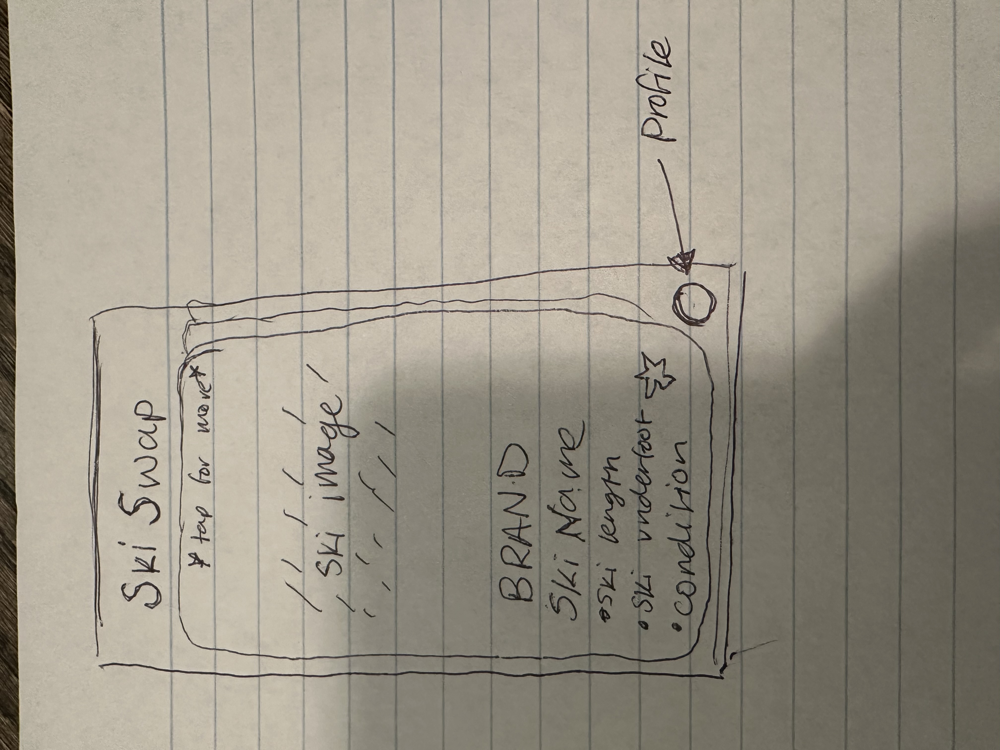

# SkiSwap
Sell Skis! Buy Skis!

"Introducing SkiSwap, the online ski marketplace that makes it easy to find your perfect ski. Think of tinder but for skis.
SkiSwap allows you to browse and purchase skis from a variety of sellers, 
but with the added convenience of being able to filter by both height and width to ensure a perfect fit. Gone are the days
of searching through skis that are too short and too tall for you on other marketplaces.
Whether you're a seasoned pro or a first-time skier, SkiSwap has the ski for you.

Key Feature:

Tinder like left and right for very simple UI (way better than KSL)

Ability to filter by length, brand, underfoot, year, condition, price

Easy integrated chat within application to contact the seller 

Ability to save skis that you want to contact seller later.

## CSS box 

I learned the order of the box model for css.

content -> padding -> border -> margin

## CSS Flexbox

I learned how css flexbox could be use to make more responsive websites

## Deliverable Learning
Making the deliverable, we learned a lot about all of the different styling that can be applied. Sometimes it was a little difficult to know how it would change the website but through lots of trial and error we got a pretty good result. We used our learning from the simon assignment to add a new page and link them together.

## Amazon webservices
I learned that in order to point to another DNS record, you should use the following DNS record type: CNAME

## functios
Many different ways to write functions. Functions can be left empty but can never be = {}. I also learned how functions can be used to simplify your code.

## Arrow functions
I learned about how arrow functions return values. The return word is optional if no curly braces are provided.
()=> returns 3 while
() => {
    3;
}; returns undefined
() => {
    return 3;
}; returns 3

Arrow functions also just replace the need to write the word function. It is very good when you need to pass a function into something. For example:

const a = [1, 2, 3, 4];

// standard function syntax
a.sort(function (v1, v2) {
  return v1 - v2;
});

however the syntax can be reduced by doing this
// arrow function syntax
a.sort((v1, v2) => v1 - v2);

I also learned all the different ways to have the syntax:
() => expression

param => expression

(param) => expression

(param1, paramN) => expression

() => {
  statements
}

param => {
  statements
}

(param1, paramN) => {
  statements
}

## Arrays
I learned about the different array functions. Such as:
push: Add an item to the end of the array
pop:	Remove an item from the end of the array
slice:	Return a sub-array
sort	Run a function sort an array in place
values	Creates an iterator for use with a for of loop
find	Find the first item satisfied by a test function
forEach	Run a function on each array item)
reduce	Run a function to reduce array to one item
map	Run a function to map an array to a new array
filter	creates a new array filled with elements that pass a test provided by a function
every	Run a function to test if all items match
some	Run a function to test if any items match

join: method creates and returns a new string by concatenating all of the elements in an array (or an array-like object), separated by commas or a specified separator string.

example: 
const elements = ['Fire', 'Air', 'Water'];
console.log(elements.join('-'));

## Objects and classes
I learned about object oriented programing. That objects can be part of classes so that that each object can have different values. For example:
class Car {
  constructor(name, year) {
    this.name = name;
    this.year = year;
  }
}

let myCar1 = new Car("Ford", 2014);
let myCar2 = new Car("Audi", 2019);

console.log(myCar1);

This would console.log 
{
"name": "Ford",
"year": 2014
}

## JSON
I learned about JSON syntax and how its used to share and store data. Here is an example of some JSON syntax
{
  "class": {
    "title": "web programming",
    "description": "Amazing"
  },
  "enrollment": ["Marco", "Jana", "فَاطِمَة"],
  "start": "2025-02-01",
  "end": null
}
JSON can be converted to and from javascript using JSON.parse and JSON.stringify
Stringify converts javascript to JSON
parse converts JSON to javascript

## Rest and Spread
I learned that The rest parameter syntax allows a function to accept an indefinite number of arguments as an array, providing a way to represent variadic functions in JavaScript.

for example:
function sum(...theArgs) {
  let total = 0;
  for (const arg of theArgs) {
    total += arg;
  }
  return total;
}

console.log(sum(1, 2, 3));
// Expected output: 6

console.log(sum(1, 2, 3, 4));
// Expected output: 10

I also learned that spread In a way, spread syntax is the opposite of rest syntax. Spread syntax "expands" an array into its elements, while rest syntax collects multiple elements and "condenses" them into a single element.

for example:
function sum(x, y, z) {
  return x + y + z;
}

const numbers = [1, 2, 3];

console.log(sum(...numbers));
// Expected output: 6

console.log(sum.apply(null, numbers));
// Expected output: 6

## Desturcturing
I learned that The destructuring assignment syntax is a JavaScript expression that makes it possible to unpack values from arrays, or properties from objects, into distinct variables. For example
const a = [1, 2, 4, 5];

// destructure the first two items from a, into the new variables b and c
const [b, c] = a;

console.log(b, c);
// OUTPUT: 1, 2
I also learned that you can combine multiple items using rest syntax. For example
const [b, c, ...others] = a;

console.log(b, c, others);
// OUTPUT: 1, 2, [4,5]

## Regular Expressions 

I learned that the forward slash character is used to denote the boundaries of the regular expression: /this_is_my_regular_expression/

I also learned about the gi modifers for regular expressions:
g = global, meaning to match all instances of the pattern in the string not one
i = case in-sensitive it doesn't care if its capital or not

## Destructuring

## Exceptions
I learned the basic syntax of exceptions:
try {
  // normal execution code
} catch (err) {
  // exception handling code
} finally {
  // always called code
}

## DOM

## Promises
I learned that the then catch finally is very similar to try catch finally.  The then function is called if the promise is fulfilled, catch is called if the promise is rejected, and finally is always called after all the processing is completed.

ALSO with promises and setTimeout we can have aysnchronous operations for example:
const delay = (msg, wait) => {
  setTimeout(() => {
    console.log(msg, wait);
  }, 1000 * wait);
};

new Promise((resolve, reject) => {
  // Code executing in the promise
  for (let i = 0; i < 3; i++) {
    delay('In promise', i);
  }
});

// Code executing after the promise
for (let i = 0; i < 3; i++) {
  delay('After promise', i);
}

// OUTPUT:
//   In promise 0
//   After promise 0
//   In promise 1
//   After promise 1
//   In promise 2
//   After promise 2

## Async/await
I learned that Async is very similar to the then catch finally for example:
const coinToss = () => {
  return new Promise((resolve, reject) => {
    setTimeout(() => {
      if (Math.random() > 0.1) {
        resolve(Math.random() > 0.5 ? 'heads' : 'tails');
      } else {
        reject('fell off table');
      }
    }, 1000);
  });
};

we could do:
coinToss()
  .then((result) => console.log(`Toss result ${result}`))
  .catch((err) => console.error(`Error: ${err}`))
  .finally(() => console.log(`Toss completed`));
OR WITH ASYNC
try {
  const result = await coinToss();
  console.log(`Toss result ${result}`);
} catch (err) {
  console.error(`Error: ${err}`);
} finally {
  console.log(`Toss completed`);
}